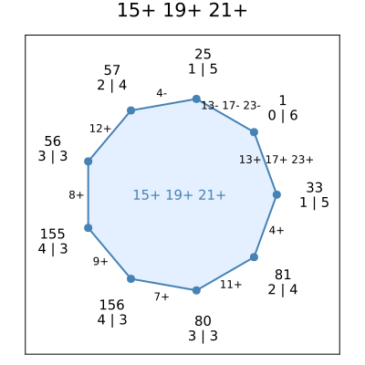
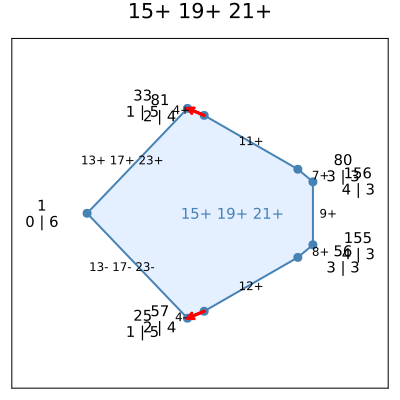

# Spindles and the Hirsch conjecture
This tutorial showcases more advanced use cases of *Spindles.jl*. For its basic usage, please read [this tutorial](@ref "First steps") first.

## The Hirsch conjecture
The [Hirsch conjecture](https://en.wikipedia.org/wiki/Hirsch_conjecture) for polytopes stated that any two vertices of a $d$-dimensional polytope with $f$ facets can be connected by a path of at most $f-d$ edges. It was disproved in 2010 when Francisco Santos found a [construction](https://arxiv.org/abs/1006.2814) that produces counterexamples from spindles with a special property: the length of a shortest path between their apices must be strictly greater than the dimension.

Santos' original counterexample from 2010 is based on a 5-dimensional spindle with 48 facets, for which the shortest path between the apices is of length 6. The minimal inequality description of this spindle (see Table 1 in Santos' [paper](https://arxiv.org/pdf/1006.2814)) can be found in the file `s-48-5.txt` located in the `examples` folder.

## Reading a spindle from a file
We read the description from the file as follows.
```@example s48
push!(LOAD_PATH, "../../../src") # hide
using Spindles # hide
A, b, labels = readineq("../../../examples/s-48-5.txt", Int);
```

```@example s48
[A b]
```
The function [`Spindles.readineq`](@ref) does not only return the data in the inequality description $Ax \le b$ from the source but also the attached labels, one for each inequality.

```@example s48
labels
```


!!! note

    Even though we use the same set of labels as Santos in his [paper](https://arxiv.org/pdf/1006.2814),
    the assignment to the rows of `A` is different.

The apices are
```@example s48
s48 = Spindle(A, b)
collect(vertices(s48))[apices(s48)]
```

and the distance between them in the graph of `s48` is indeed 6:
```@example s48
dist_toapex(s48, apices(s48)...)
```

Both apices are highly degenerate:
```@example s48
using Graphs: degree
degree(graph(s48), apices(s48))
```

## Inspecting faces
The original motivation for developing *Spindles.jl* was the search for special two-dimensional faces (or **2-faces** for short) of the spindle `s48` and similar spindles. Specifically, take the following three facets:

```@example s48
face = [29, 37, 41]
labels[face]
```

They indeed define a 2-face of `s48`:
```@example s48
face in facesofdim(s48, 2)
```

We may use the function [`Spindles.plot2face`](@ref) provided by *Spindles.jl* to plot the graph of this face.
```julia
plot2face(s48, face, facetlabels=labels, showdist=true, figsize=(400,400))
```

This produces the following output:



As one would expect from a 2-face, the graph is a cycle. Each vertex is labeled by its index (on the first line) and the distance to each of the two apices of `s48` (on the second line). For example, `1 | 5` in the label of vertex `25` means that `25` is one edge step away from the first apex `apices(s48)[1]` and five steps away from `apices(s48)[2]`.
Likewise, the label `0 | 6` for vertex `1` means that `1` is at distance 0 from `apices(s)[1]`. This should not be surprising given that `1` *is* the index of the first apex:

```@example s48
apices(s48)
```

Edges are labeled by their incident facets, where the three facets that define the face are omitted.

## Good 2-faces
Note that for each vertex in the plot above, the sum of both distances must be at least 6 because we know that there is no shorter path between the apices. In fact, there are two such shortest paths that traverse parts of the face: Starting at the first apex `1`, we may take 3 steps to either `56` or `80`. Both vertices are at distance 3 from the second apex, as their labels tell us. 
The only two vertices that are not visited on either of those two paths are `155` and `156`, and they are also at distance 3 from the second apex. 

So among the vertices of the face `15+ 19+ 21+`, there are two special subsets:
One subset of vertices, let us call it $V_1$, is "close" to the first apex (namely, take $V_1$ to be the apex `1 ` itself). The other subset $V_2$ (the subset consisting of `56`, `155`, `156`, and `80`) is disjoint from the first one, and each vertex in $V_2$ is "close" to second apex . Here, "close" means that if we pick two arbitrary vertices, one from each subset, then the sum of their distances to the respectively closest apex is at most 3, which is 2 less than the dimension of `s48`. Moreover, each vertex in $V_2$ is at least 3 edge steps away from $V_1$ on the face.

Let us call 2-faces with this property **good**. Good 2-faces play an important role for analyzing `s48` in the setting of the so-called **circuit diameter conjecture**, a relaxation of the Hirsch conjecture. *Spindles.jl* provides a function [`Spindles.isgood2face`](@ref) that tests a face for being good.

```@example s48
isgood2face(s48, face)
```

The result is wrapped in a bespoke data type defined by *Spindles.jl* called [`Spindles.FaceState`](@ref). The field `good` indicates whether or not the tested face is good, and the two vertex sets $V_1$ and $V_2$ that certify the property of being good are stored in the field `vsets` (see also the documentation on the [`Spindles.FaceState`](@ref) type):

```@example s48
fstate = isgood2face(s48, face)
fstate.good, fstate.vsets
```


Let us plot it again, but this time not as a graph but as a two-dimensional projection. This is achieved by setting the option `usecoordinates` to `true`:
```julia
plot2face(s48, face, facetlabels=labels, showdist=true, usecoordinates=true, figsize=(400,400))
```

Now the output is this:



We may also enumerate all good 2-faces of `s48` as follows.
```@example s48
for f in sort(facesofdim(s48, 2))
    if isgood2face(s48, f).good
        println(join(labels[f], " "))
    end
end
```

In particular, for each good 2-face, there must exist paths from both apices to some vertex on the face of total length at most 3. 
Interestingly, all 2-faces of `s48` that satisfy this weaker condition are good:
```@example s48
for f in sort(facesofdim(s48, 2))
	min_total_length = sum(
		minimum(
			dist_toapex(s48, a, v) for v in Spindles.incidentvertices(s48, f)
		) for a in apices(s48)
	)
	if min_total_length <= 3
		println(join(labels[f], " "), "\t", isgood2face(s48, f).good)
	end
end
```

